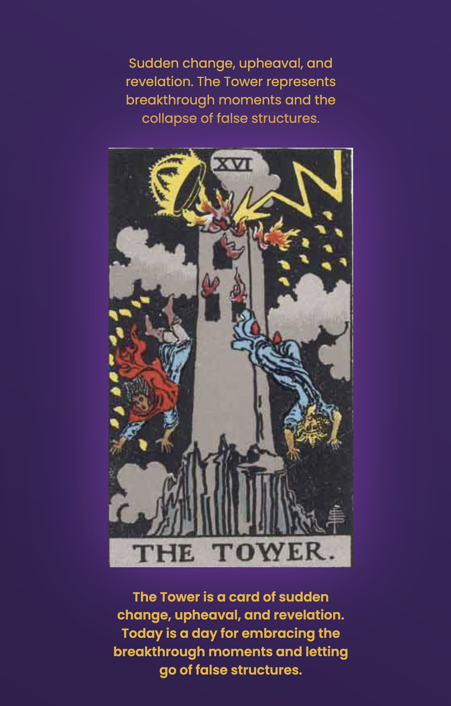

# TarotAppProject

A simple Tarot card reading application that helps users understand card meanings and give a quick fortune. 
This is not meant to be a complex "meta" Tarot application.  
Instead, it focuses on being an educational tool to help users understand the meanings and interpretations of Tarot cards in a straightforward way.

## About

This project is being developed as part of a Codecademy course. It provides a straightforward interface for users to:

## Features

- Single card readings
- Database of Tarot cards and their meanings
- Simple user interface
- Major Arcana

## Technologies Used

- HTML
- CSS
- JavaScript
- Netlify (for deployment)

## Future Features

- Question-based interpretations
- More cards
- More readings
- More features

